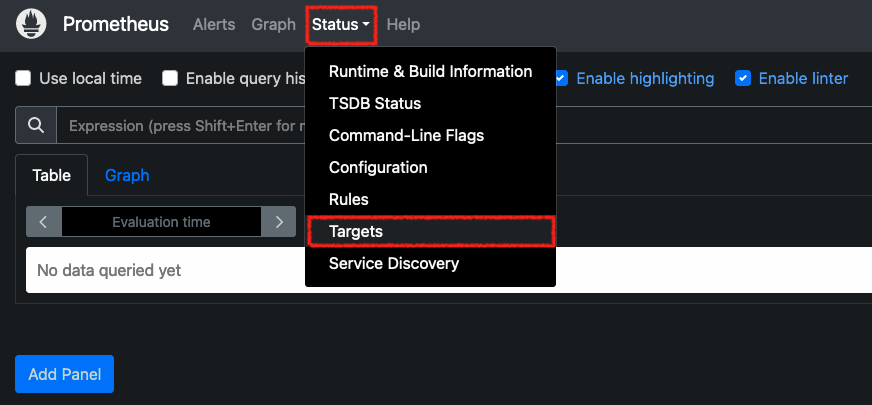

# Prometheus instrumentation examples in Python, Golang and Rust

## Prerequisites
- Docker
- Docker Compose V2

## Prometheus server scrapes applications


Three applications are running and Prometheus server scrapes them.

### Run Prometheus server and applications

```shell
$ docker compose -f compose-prometheus.yaml up
```

### Check target status


Open `http://localhost:80` and check all targets are up. Click `Status` -> `Targets` and see `axum-app`, `echo-app`, `flask-app` and `prometheus-server-itself` are up.




### Send some requests
Flask application is running at port 5000, Echo applications is at port 8888 and Axum application is at port 3000. Send some requests to them.

```shell
# requests to Flask application
$ curl -XPOST http://localhost:5000/movies
{"movies":["movie42"]}
$ curl -XPOST http://localhost:5000/movies
{"movies":["movie42","movie10"]}
$ curl http://localhost:5000/movies
{"movies":["movie42","movie10"]}
# requests to Echo application
$ curl -XPOST http://localhost:8888/movies
[{"ID":881}]
$ curl -XPOST http://localhost:8888/movies
[{"ID":881},{"ID":947}]
$ curl -XPOST http://localhost:8888/movies
[{"ID":881},{"ID":947},{"ID":717}]
curl http://localhost:8888/movies
[{"ID":881},{"ID":947},{"ID":717}]
# requests to Axum application
$ curl -XPOST http://localhost:3000/movies
[{"id":18168806418232667828}]$ curl -XPOes http://localhost:3000/movie
[{"id":18168806418232667828},{"id":16276746138974980245}]
$ curl http://localhost:3000/movies
[{"id":18168806418232667828},{"id":16276746138974980245}]
$ curl -XDELETE http://localhost:3000/movies/1
[{"id":18168806418232667828}]
```

### Visualize metrics using Prometheus UI


Execute PromQL like `axum_movies_count` and now you can see metrics graph.

### Clean up

```shell
$ docker compose -f compose-prometheus.yaml down
```

## ADOT collector scrapes applications and send metrics to Prometheus server


Three applications are running and OpenTelemetry collector scrapes them, then it remote writes to Prometheus server.

### Run Prometheus server, ADOT collector and applications

```shell
$ docker compose -f compose-adot-collector.yaml up
```
### Check target status
You can see only `prometheus-server-itself` in targets.

### Send some requests
Flask application is running at port 5000, Echo applications is at port 8888 and Axum application is at port 3000. Send some requests to them.

```shell
# requests to Flask application
$ curl -XPOST http://localhost:5000/movies
{"movies":["movie42"]}
$ curl -XPOST http://localhost:5000/movies
{"movies":["movie42","movie10"]}
$ curl http://localhost:5000/movies
{"movies":["movie42","movie10"]}
# requests to Echo application
$ curl -XPOST http://localhost:8888/movies
[{"ID":881}]
$ curl -XPOST http://localhost:8888/movies
[{"ID":881},{"ID":947}]
$ curl -XPOST http://localhost:8888/movies
[{"ID":881},{"ID":947},{"ID":717}]
curl http://localhost:8888/movies
[{"ID":881},{"ID":947},{"ID":717}]
# requests to Axum application
$ curl -XPOST http://localhost:3000/movies
[{"id":18168806418232667828}]$ curl -XPOes http://localhost:3000/movie
[{"id":18168806418232667828},{"id":16276746138974980245}]
$ curl http://localhost:3000/movies
[{"id":18168806418232667828},{"id":16276746138974980245}]
$ curl -XDELETE http://localhost:3000/movies/1
[{"id":18168806418232667828}]
```

### Visualize metrics using Prometheus UI


Execute PromQL like `axum_movies_count` and now you can see metrics graph.

### Clean up

```shell
$ docker compose -f compose-adot-collector.yaml down
```